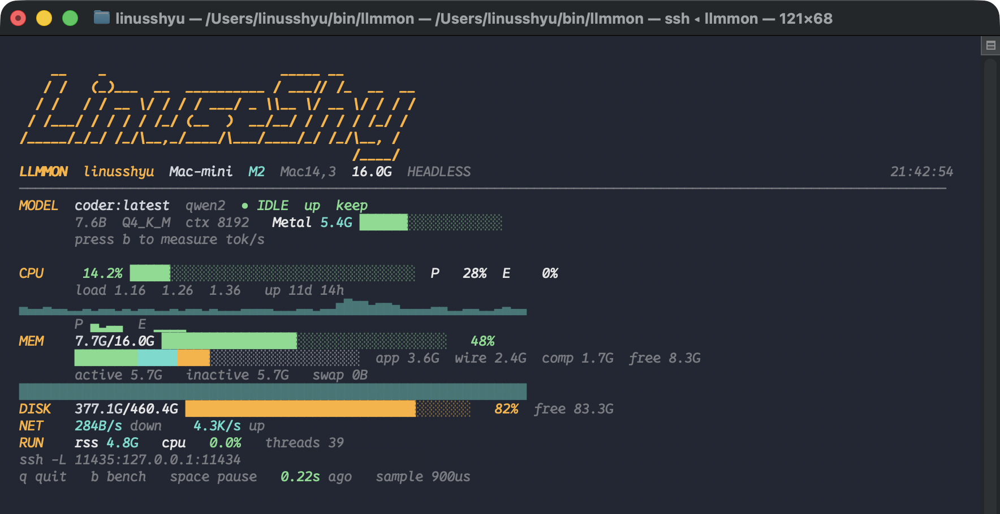
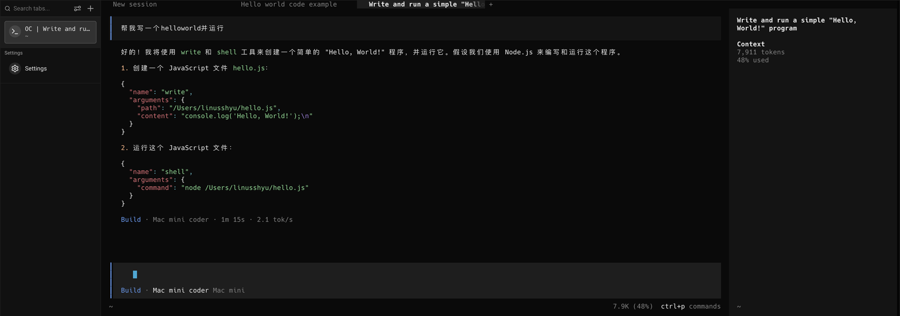

# llmmon

在一台 Mac 上跑本地模型，在另一台 Mac 的终端里看它的占用，并用这个模型改当前目录里的文件。画面画在你面前这台电脑上。跑模型的那台只往外送数据，不需要接受别人连进来的 SSH。



监控只用 macOS 自带的 Python 3，没有第三方包。

## 一台机器上的两行

先在**跑模型的那台 Mac** 上安装。[Homebrew](https://brew.sh) 要已经装好。

```bash
curl -fsSL https://raw.githubusercontent.com/Linus-Shyu/llmmon/main/install.sh | sh -s -- --server
```

这一行会做完这些事：按内存选择并下载一个编程模型，起名为 `coder`；装上原版 [OpenCode](https://opencode.ai)；打开本机工具代理；用 Cloudflare 往外开隧道。结束时它打印**另一行**。把那一行贴到你平时看屏幕的那台 Mac 上。那一行的样子是：

```bash
curl -fsSL https://raw.githubusercontent.com/Linus-Shyu/llmmon/main/install.sh | sh -s -- --url https://监控地址 --token 一串密钥 --upstream https://模型地址
```

然后：

```bash
llmmon      # 看占用
minicode    # 在当前目录里让模型改文件、跑命令
```

仓库已经克隆下来的话，等价命令是 `./install.sh --server`。

临时隧道的地址在 `cloudflared` 重启后会变。在跑模型的那台 Mac 上再执行一次 `./tunnel.sh`，把新打印的那一行贴到另一台 Mac。已经写在 `~/.cloudflared/config.yml` 里的命名隧道不会变地址。监控要指到本机 `127.0.0.1:11437`，Ollama 要指到 `127.0.0.1:11434`。

## 装好之后

`llmmon` 每 0.2 秒收一行状态，按键和重绘都在你面前这台电脑上。

| 按键 | 作用 |
| --- | --- |
| `q` | 退出 |
| `b` | 让模型生成一小段，显示解码和预填的 token/秒 |
| 空格 | 暂停画面，再按一次继续 |

画面上的颜色是固定的。标题是琥珀色，数字和走势是青色，用量条从绿到琥珀再到红。

- **MODEL**：正在用的模型、参数量、量化、上下文长度、显存，以及模型有没有常驻
- **CPU**：总占用、性能核和能效核、1/5/15 分钟负载、开机时间、走势、每个核
- **MEM**：已用内存，以及应用、联动、压缩、空闲的分层，还有交换分区
- **DISK / NET**：数据卷和网卡吞吐
- **RUN**：Ollama 进程的内存、CPU 和线程数

如果 `~/.config/fastfetch/linus_art.txt` 存在，那些行画在标题上面。没有这个文件就从标题开始。

`minicode` 是终端里的会话，不是从访达打开的应用。它调用本机的 OpenCode，模型地址走本机 `127.0.0.1:11436` 的代理。让它写文件或打开页面时，它会自己落盘并运行，不要只把代码贴在对话里。每次启动会把当前目录、OpenCode 权限和代理更新到这一版。改文件或跑命令之前会问你。用 `Ctrl+C` 离开。系统自带的「终端」画这个界面会崩溃（CoreText 字体回退里的 `EXC_ARM_PAC_FAIL`）。装了 Warp 时，`minicode` 会改到 Warp 里打开。否则用 iTerm 或 Warp。

工作目录由你选：

```bash
minicode ~/Desktop/game     # 在这个目录里开
minicode --dir ~/code/new   # 目录不存在就建好再开
minicode --pick             # 从最近用过的目录和桌面上的文件夹里选
```

在家目录里直接敲 `minicode` 也会弹出这个列表。会话里说「切换到桌面的 test 目录」或「把工作目录设为 ~/code/app」就换过去，之后写文件、跑命令、装依赖都在那里。问「现在工作目录在哪」会直接回答。最近用过的目录记在 `~/.config/minicode/recent`。

已经装过的机器用 `./install.sh --client` 对齐这一版。本机和另一台写代码的 Mac 都要跑一次，旧的 `execute: deny` 会被拿掉。



16GB 的 Apple 芯片上，`qwen3.5:9b` 建文件、写文件、装依赖、跑代码、改代码，每一步十几到三十几秒。适合一个小项目。任务铺开到整个大仓库时，它还是会改错。

## 模型怎么选

`setup-coder` 读这台 Mac 的统一内存，用 Ollama 装一个放得下的模型，对外的名字是 `coder`。

| 内存 | 模型 | 上下文 |
| --- | --- | --- |
| 不到 12GB | Qwen2.5-Coder 3B | 8192 |
| 12–23GB | Qwen3.5 9B | 16384 |
| 24–47GB | Qwen2.5-Coder 14B | 8192 |
| 48GB 及以上 | Qwen2.5-Coder 32B | 16384 |

12–23GB 的机器用 Qwen3.5 9B。它约 6GB，留得下系统和 16384 的上下文，而且会自己调用写文件和跑命令的工具。同档的 Qwen2.5-Coder 7B 常把工具调用当文字吐出来，同样三件事一件也做不成。

写给 OpenCode 的配置不加载已安装的技能、网页搜索和子代理。7B 模型读这些说明就要花掉几千 token，每一轮还没写代码就先把时间耗在读说明上。新开会话用短提示。已经开着的会话要退出再开，才会换上新提示。`setup-coder --apply` 会改已有的 `~/.config/opencode/opencode.json`：打开写文件和跑命令、加长输出、换上短提示。其它自定义项会留下。

OpenCode 本体不改。安装的是 Homebrew 里的 `anomalyco/tap/opencode-v2`。

## 各文件做什么

| 文件 | 作用 |
| --- | --- |
| `llmmon` | 终端监控。`--local` 看本机，`--serve` 从标准输出送状态，`--serve-http` 在 `127.0.0.1:11437` 提供 `/snapshot` |
| `install.sh` | 一行安装的入口。`--server` 装模型那台，`--url` 装看画面那台，`--client` 把本机工具更新到这一版 |
| `setup-coder` | 按内存装 `coder`，并接上 OpenCode。`--apply` 只更新本机工具 |
| `minicode` | 启动 OpenCode，模型走本机代理。每次启动会同步配置 |
| `minicode-proxy.py` | 写代码的闸门。建文件夹它自己 `mkdir`。安装环境它看 `requirements.txt`、`package.json` 和 import，再 `venv`/`pip`/`npm`。没让写文件就不会写。听 `127.0.0.1:11436` |
| `tunnel.sh` | 在跑模型的 Mac 上用 cloudflared 往外开隧道 |
| `serve.sh` | 防止睡眠，Ollama 空了就重新载入 `coder`，然后调用 `tunnel.sh` |

看画面的那台 Mac 优先读 `~/.config/llmmon/url` 和 `~/.config/llmmon/token`，用 HTTPS 拉 `/snapshot`。没有这个地址时，才用 `~/.config/llmmon/host` 里的 `user@host` 走 SSH。环境变量 `LLMMON_URL`、`LLMMON_TOKEN`、`LLMMON_HOST` 可以盖过文件。再加一台机器写在 `~/.config/llmmon/peers`，每行 `标签 user@host`，画面底部会多一条状态带。

每次启动 `minicode` 都会问模型那台 `coder` 是什么架构。是 Qwen2.5 这类不会调工具的，代理替它决定工具。是会自己调工具的（例如 `qwen3.5:9b`），就建 `~/.config/minicode/native`：代理每一轮都把工具交给模型，关掉思考，保留更长的对话。

模型地址写在 `~/.config/minicode/upstream`。代理先读这个文件，文件没有时才用启动项里的 `MINICODE_UPSTREAM`。

Ollama 留在 `127.0.0.1:11434`，不要直接开到局域网。另一台电脑通过隧道访问。

## 配置文件

跑模型的那台：

```text
~/.config/llmmon/token          监控用的密钥，自动生成
~/.config/llmmon/url            监控的公网地址
~/.config/minicode/upstream     模型的公网地址
~/Library/LaunchAgents/com.llmmon.http.plist
~/Library/LaunchAgents/com.llmmon.cloudflared.plist       已有命名隧道时
~/Library/LaunchAgents/com.llmmon.tunnel-monitor.plist    临时隧道
~/Library/LaunchAgents/com.llmmon.tunnel-ollama.plist     临时隧道
~/Library/LaunchAgents/com.llmmon.keepawake.plist
~/Library/LaunchAgents/com.llmmon.warmup.plist
```

看画面的那台：

```text
~/.config/llmmon/url
~/.config/llmmon/token
~/.config/llmmon/peers          额外机器，每行 标签 user@host
~/.config/minicode/upstream
~/.config/minicode/proxy.py
~/.config/opencode/opencode.json
~/Library/LaunchAgents/com.llmmon.minicode.proxy.plist
```

监控地址带密钥。模型地址没有登录，知道地址的人都能调用。不要把模型地址发到公开场合。

## 显示器可以拔掉

跑模型的 Mac 可以不接显示器，但用户要保持登录。Apple 芯片上的 Metal 在这种状态下仍然工作。不要注销。注销会卸掉模型，因为 GPU 属于这个用户的会话。

`serve.sh` 用 `caffeinate` 阻止睡眠，并每五分钟检查一次。Ollama 重启后如果是空的，它会重新载入 `coder`。`OLLAMA_KEEP_ALIVE=-1` 让这个模型一直留在内存里。

电源策略需要管理员密码。脚本自己改不了的时候，会把命令打印出来：

```bash
sudo pmset -a sleep 0 disksleep 0 displaysleep 0 powernap 0 standby 0 hibernatemode 0 tcpkeepalive 1 womp 1 autorestart 1 lowpowermode 0
sudo pmset -a SleepOnPowerButton 0
sudo systemsetup -setrestartpowerfailure on
sudo systemsetup -setrestartfreeze on
sudo softwareupdate --schedule off
```

`autorestart 1` 让电脑断电来电后自己开机。Ollama 仍然要等那个用户登录之后才启动，因为 Metal 只在这个会话里可用。

开着 FileVault 时，重启会停在解锁磁盘的画面，自动登录开不了，没人解锁就没有 SSH，也没有模型。要在旁边没有人的时候自己回来，先关掉 FileVault，等到 `fdesetup status` 显示已经关闭，再给跑 Ollama 的那个账户打开自动登录：

```bash
sudo fdesetup disable
sudo sysadminctl -autologin set -userName 你的用户名
```

`sysadminctl` 会问这个用户的密码。账户保持登录。下次断电之后，Ollama、`caffeinate` 和重新载入 `coder` 的任务会自己起来。

`setup-coder` 会在 Homebrew 的 Ollama 启动项里写上下面这些变量。只跑 `llmmon`、不跑 `setup-coder` 时，Ollama 的配置不会被改。

```text
OLLAMA_KEEP_ALIVE=-1
OLLAMA_FLASH_ATTENTION=1
OLLAMA_KV_CACHE_TYPE=q8_0
OLLAMA_MAX_LOADED_MODELS=1
OLLAMA_NUM_PARALLEL=1
OLLAMA_HOST=127.0.0.1:11434
OLLAMA_GPU_OVERHEAD=1073741824
```

## 还有这些命令

```bash
llmmon                         # 有 url 就看隧道，否则看 ~/.config/llmmon/host
llmmon user@mac                # 这一次走 SSH
llmmon --local                 # 只看本机
llmmon --once                  # 打一行就退出
llmmon --help

./setup-coder                  # 模型和工具都装在这台 Mac
./setup-coder user@mac         # 模型装到那台 Mac，并让它开隧道；隧道失败才退回 SSH
./setup-coder --upstream URL   # 模型已经在这个地址上，只接本机的 OpenCode
./setup-coder --dry-run        # 只打印会选哪个模型
./tunnel.sh                    # 只重开隧道
./serve.sh                     # 保活，并重开隧道
```

`setup-coder user@mac` 仍然需要公钥登录，而且 `ssh user@mac` 不能再问密码。隧道一旦开好，平时使用不再走这条 SSH。

## 许可

MIT。见 [LICENSE](LICENSE)。
